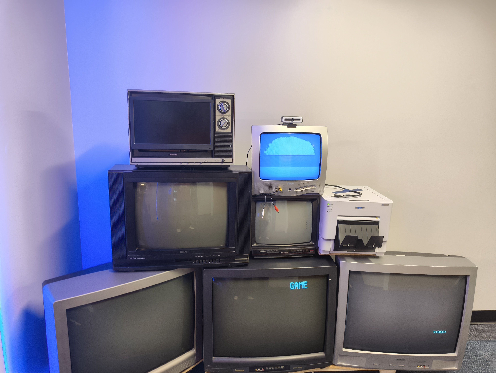
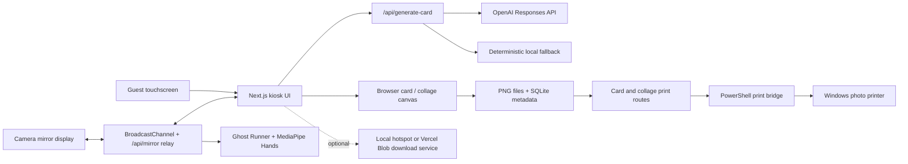

# GBooth

GBooth is an interactive photo-booth kiosk built for Gettysburg College. A single full-screen home experience brings together an AI-assisted trading-card maker, a customizable photo-strip booth, and a camera-controlled arcade game. The kiosk coordinates its camera displays, saves finished cards locally, and sends print-ready PNGs directly to a Windows photo printer without opening a browser print dialog.

<p align="center">
  
</p>

## Experiences

### Trading Card

Guests take a portrait, enter their name, and describe themselves. GBooth then:

- captures a mirrored three-second-countdown portrait through the booth camera;
- uses the OpenAI Responses API to create a card title, three traits, scores, rarity, a “Known For” line, a special ability, and a matching visual template;
- validates the generated result against a strict Zod schema;
- falls back to deterministic local generation when the API key is absent or generation fails;
- renders the portrait and card data into a Gettysburg-themed collectible card;
- exports the composed card as a PNG, stores it on the kiosk, records its metadata in SQLite, and prints it on demand; and
- keeps the local cache bounded to the newest 100 cards.

### Photo Collage

The photo-strip workflow supports:

- two-, three-, and four-photo layouts;
- an automatic countdown and sequential capture session;
- retaking the entire set;
- six image filters;
- preset frame colors and a custom color picker;
- drag, reposition, resize, and clear controls for emoji stickers;
- a Gettysburg/ICL-branded printable canvas; and
- calibrated 4×6 double-strip output for the kiosk printer’s center cut.

### Ghost Runner

Ghost Runner runs as an embedded attract screen on the home page and switches to the full game when selected. It includes:

- two levels with animated instructions, obstacles, enemies, scoring, sound, and a local leaderboard;
- MediaPipe hand tracking for camera-based movement and jumping;
- a shared-camera path that accepts frames from the booth mirror instead of competing for the webcam;
- direct-camera fallback for development or standalone play; and
- fullscreen, idle-return, and always-visible Home behavior suited to an unattended kiosk.

## Kiosk Behavior

- A four-panel landing screen launches the three experiences and explains the booth.
- Inactivity returns an active guest flow to the home screen after a warning.
- A separate camera-mirror page can run on the booth’s second display.
- `BroadcastChannel` provides the fast same-browser camera path; `/api/mirror` supplies a polling relay when the displays do not share that channel.
- LAN requests are restricted so a guest on the booth hotspot cannot control the kiosk, trigger printing, or browse other saved cards.
- Finished cards are written to `.booth-storage`; raw capture data is not persisted separately.
- Printing is performed by a PowerShell bridge against the Windows default printer or a configured printer name.

## Architecture



### Frontend

`src/components/BoothApp.tsx` is the top-level state machine. It owns the home chooser and transitions between card setup, generation, reveal, and collage views. The photo-card UI is split into capture, form, preview, and reveal components. `PhotoCollage.tsx` owns its own layout → camera → decoration → final workflow. Ghost Runner remains a self-contained HTML/canvas application under `public/ghost-runner` and is hosted inside an iframe.

### Camera and display coordination

The mirror page owns the physical camera during normal kiosk operation. The kiosk asks it to start, run countdowns, capture still images, or stream reduced frames for hand tracking. Messages travel through a same-origin `BroadcastChannel` when possible and through the in-memory `/api/mirror` event relay as a compatibility path. Development mode can capture directly from a local camera stream.

### Card generation

`POST /api/generate-card` validates the guest input and calls the server-side generator. OpenAI receives only the self-description and theme needed to create the card identity; the browser controls the portrait and final layout. The response must match a JSON schema and is normalized through Zod. Any missing key, network failure, invalid response, or parsing failure returns a usable locally generated card instead.

### Persistence and printing

The reveal screen renders the completed card DOM to a PNG. The server writes that PNG under `.booth-storage/cards` and stores its metadata in `.booth-storage/cardifybooth.db`. Print routes validate the requested file or PNG payload and call `scripts/print-card.ps1`, which creates the calibrated 4×6 print job. Photo strips are composed as a double-strip sheet before being sent through the same bridge.

### Network boundary

`src/proxy.ts` distinguishes requests made locally by the kiosk from requests arriving over the LAN. Localhost receives the full application. A guest network receives only the explicitly allowed download endpoint, plus the mirror endpoint when remote-mirror access is intentionally enabled. This is a practical kiosk privacy boundary, not a substitute for isolating sensitive data from the booth computer.

## Technology

- Next.js 16 App Router, React 19, and TypeScript
- Tailwind CSS 4
- OpenAI Responses API with structured JSON output
- Zod validation
- SQLite through `better-sqlite3`
- `html-to-image` for card PNG rendering
- HTML Canvas for collage composition and Ghost Runner
- MediaPipe Hands for motion controls
- PowerShell and Windows printing APIs
- Optional Vercel Blob support for public phone downloads

## Project Structure

```text
src/
  app/
    api/                  generation, storage, mirror, leaderboard, and print routes
    local-cards/          local saved-card viewer
  components/             kiosk, card, camera, reveal, and collage interfaces
  lib/                    schemas, generation, rendering, storage, and print helpers
  proxy.ts                localhost/LAN access policy
public/
  camera-mirror.html      second-display camera owner and relay client
  ghost-runner/           canvas game, assets, hand tracking, and attract mode
  cardify/                kiosk artwork
  cards/                  trading-card templates
scripts/
  print-card.ps1          silent Windows PNG printing
  check-printer-media.ps1 printer-media monitoring and alerting
docs/                     operational notes, calibration, and screenshots
```

## Local Development

Requirements: Node.js, npm, and a modern browser. Camera, microphone, printer, and kiosk-specific behavior require the corresponding Windows hardware and permissions.

```powershell
git clone https://github.com/ashimaryal25-ops/gbooth_ver3.git
cd gbooth_ver3
npm install
Copy-Item .env.example .env.local
npm run dev
```

Open [http://localhost:3000](http://localhost:3000). For laptop camera testing, open the app with `?devcam=1`. The trading-card generator works without an OpenAI key by using its local fallback.

## Configuration

| Variable | Purpose |
| --- | --- |
| `OPENAI_API_KEY` | Enables AI-generated card identities. |
| `OPENAI_MODEL` | Selects the generation model; defaults to `gpt-5-mini`. |
| `CARDIFYBOOTH_PRINTER_NAME` | Optional exact Windows printer name; blank uses the default printer. |
| `CARDIFYBOOTH_LOCAL_DOWNLOAD_BASE_URL` | Enables kiosk-hosted phone downloads; use `auto` for LAN detection. |
| `NEXT_PUBLIC_CARDIFYBOOTH_HOTSPOT_SSID` | Shows the guest Wi-Fi join step and can imply local download mode. |
| `NEXT_PUBLIC_CARDIFYBOOTH_HOTSPOT_PASSWORD` | Included in the guest Wi-Fi QR code. |
| `BLOB_READ_WRITE_TOKEN` | Enables Vercel Blob as the public-download fallback. |
| `CARDIFYBOOTH_ALLOW_REMOTE_MIRROR` | Allows the mirror page and relay over LAN when set to `true`. |
| `CARDIFYBOOTH_TRUSTED_HOSTS` | Additional hosts allowed to access the full kiosk. |

The remaining optional printer-media alert settings are documented in `.env.example`.

## Production Kiosk

```powershell
npm install
npm run build
npm run start -- -H 0.0.0.0 -p 3000
```

The included PowerShell and batch launchers configure the workstation, start the server, and open the kiosk/mirror displays. See [KIOSK_SETUP.md](KIOSK_SETUP.md) for the Windows installation, camera permissions, printer configuration, hotspot mode, and hardware checks.

## Validation

```powershell
npm run lint
npm run build
```

## License

See [LICENSE](LICENSE).
